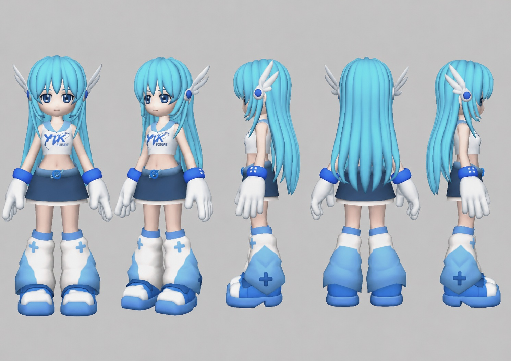

# Yuki Community Engine

An easy creative tool for making canon-consistent images, memes, cinematics, and episodes with Yuki / YUKI.EXE from the Y2K Dotcom ecosystem.

You do not need to know prompting.

Tell the Engine what Yuki is doing. It handles her identity, Y2K-era grounding, registered visual styles, camera direction, continuity, storyboards, animation prompts, and common repairs.

PS2 and named-game requests now begin with authentic gameplay-reference grounding so the Engine matches real console geometry, textures, lighting, and camera language—not a modern render with a retro filter.

## What you need

- **A paid ChatGPT plan.** Personal Skills are not available on Free or Go. Managed workspaces may require admin approval.
- **Image generation in ChatGPT** for pictures. The Engine makes the image in the chat.
- **A video tool for video.** The Engine does not render video itself. It writes prompts for fal.ai MiniMax H3 Max, Seedance, Kling, Sora, or another video tool. Those products and credits are separate.

## Install in ChatGPT

Install from [chatgpt.com](https://chatgpt.com) in a browser. If you also use the desktop app, add the Skill there separately.

1. Download [yuki-community-engine.zip](https://github.com/nosimajtechnology/yuki-community-engine/releases/latest/download/yuki-community-engine.zip). **Do not unzip it.**
2. In ChatGPT, open **Plugins** from the sidebar, then **Skills** → **Create** → **Upload from your computer**, and pick the zip.
3. Start a new chat.

Use this as your first prompt:

```text
Load the "Yuki Community Engine" skill.
```

Then describe your idea:

```text
Make an image of Yuki working at a 2001 internet cafe.
```

If the picture looks right, reply `Approved.` If something is off, say exactly what:

```text
Her hair is too short. Fix only that.
```

## What you can make

- **CHARACTER** — clean character study
- **STILL** — one finished picture
- **SCENE** — one contained visual event
- **CLASSIC CINEMATIC** — first frame → storyboard → video prompt
- **MEME** — fast community remix
- **COMMERCIAL** — fictional Y2Kverse ad
- **EPISODE** — longer story across progressive storyboards

You can name a mode or let the Engine choose.

## Late-Z and H3 Max

The Engine now includes a broadcast-grounded **Late-Z Battle Cel** style with a
dedicated Yuki translation sheet. For fal.ai MiniMax H3 Max video, it routes the
idea by creative intent:

- **Classic Control / I2V** — approve a GPT Image 2 Genesis Frame and storyboard;
  upload only the Genesis Frame as the literal opening frame.
- **Direct Explore / T2V** — iterate quickly from a self-contained text prompt
  with no references.
- **Character Lock / R2V** — use Yuki's canonical sheet first, then the Late-Z
  sheet as style-only authority when that adapter is active.

## Canonical Yuki reference

This turnaround is the visual authority bundled with the Engine. It locks Yuki's face, cyan hair, blue eyes, paired wing ornaments, chibi proportions, oversized gloves, blue-white boots, and recognizable silhouette. Scenes, expressions, poses, props, and requested outfits may change.



## Source of truth

The installable, canonical Skill lives in [`skill/yuki-community-engine/`](./skill/yuki-community-engine/). The root [`SKILL.md`](./SKILL.md) is only a compatibility entry point for tools that scan repository roots; it delegates to the canonical manifest and contains no independent Engine rules.

Releases package only the canonical directory. Contributors should make all Engine behavior, reference, and asset changes there. CI rejects a root entry point that stops delegating or starts carrying a second implementation.

## Need an idea?

- Open the [community quickstart](./community/quickstart/quickstart.md).
- Browse the [starter remix templates](./community/remix-templates/starter-templates.md).

## Community use

Same recognizable Yuki. Different people's ideas.

Community creations are unofficial by default. The Engine separates verified canon, community convention, historical grounding, and creative interpretation instead of inventing lore as official.

Suggested credit:

> Yuki / YUKI.EXE belongs to the Y2K Dotcom ecosystem. Community-created scene using the Yuki Community Engine by Nosimaj Media.

This is a creative-production tool. It does not provide token trading advice, price targets, or financial promises.

Learn more at [Y2K Dotcom](https://www.y2kdotcom.xyz/) and [Nosimaj Media](https://nosimaj.com).
